# Introduction
The AADL/AGREE Simulator is an Eclipse-based tool that is designed to add simulation capabilities to the Open Source AADL Tool Environment (OSATE). It integrates with the AGREE analysis tools to simulate Architecture Analysis and Design Language (AADL) models which contains AGREE contracts. 

This document describes the usage of the simulator.

# Getting Started
The following sections will provide an overview of how to simulate an AADL component implementation using the simulator.

## User Interface Overview{#sec:ui_overview}
The simulator provides a graphical and tabular means of viewing the state of the simulation. An overview of the user interface is shown in @fig:ui_overview.

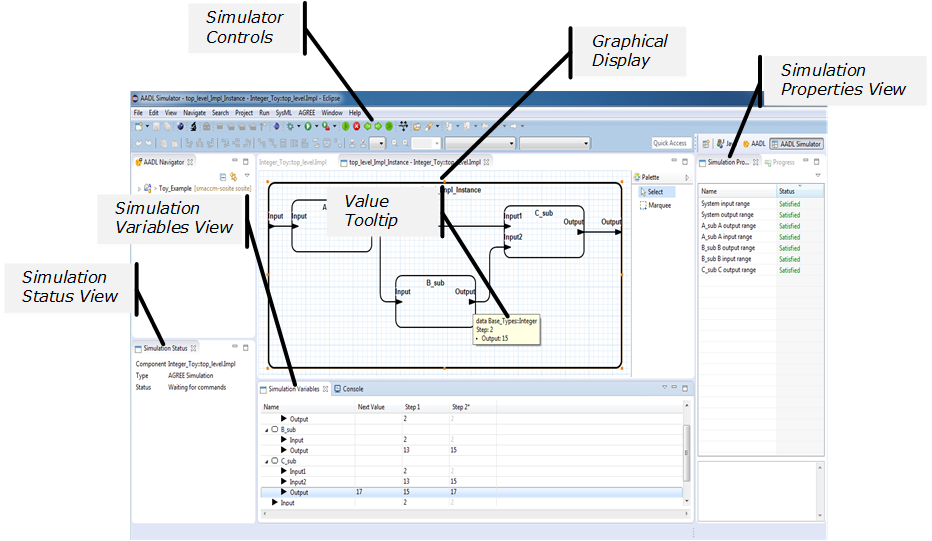{#fig:ui_overview}

### Simulation Status View
The *Simulation Status* view displays information about the currently active simulation. If the simulation is unable to proceed for any reason, it will be displayed in this view.

### Simulator Controls
The toolbar contains items for starting, stopping, stepping forward, and stepping backward. When a simulation is active, these commands are also available in the *Run* menu.

### Graphical Display
The graphical display contains a graphical representation of the AADL model being simulated. The values of variables associated with any subcomponent or feature is displayed in a tooltip whenever the mouse cursor hovers over the appropriate shape.

### Simulation Variables View
The *Simulation Variables* view provides a tabular display for the values of simulation variables. The values from every step of the simulation are displayed in the table. It also allows selecting which simulation step is displayed in the graphical display. The selected column is indicated by an asterisk. The *Next Value* column displays the input constraints for the next step. If the simulator has pre-determined the value of a variable for the next step based on the simulation state and the currently entered input constraints, it will be displayed in the *Next Value* column using grey text.

### Simulation Properties View
The *Simulation Properties* view shows the status of properties defined in the AGREE specification. The view allows disabling properties and navigating to the property definition within the AGREE specification.

## Starting the Simulator
The simulator supports simulating component implementations. In order for a component implementation to be simulated, it must have an AGREE specification.
Follow the following instructions to simulate a component implementation:

1. Open the AADL model to be simulated in the textual editor.
1. In the *Outline* view, right-click on the component implementation to be simulated and select *Simulate* from the context menu.

The simulation will start using the default AADL Simulation run configuration for the component implementation. If a run configuration does not exist for the component implementation, a monolithic simulation will be started. Once the simulation has started, the AADL Simulator perspective will become active and the graphical display will be shown. 

### Simulating a Single Layer
Follow the following instructions to start a single layer simulation of a component implementation:

1. Open the AADL model to be simulated in the textual editor.
1. In the *Outline* view, right-click on the component implementation to be simulated and select *AGREE->Simulate Single Layer* from the context menu.

### Simulating Monolithically
Follow the following instructions to start a monolithic simulation of a component implementation:

1. Open the AADL model to be simulated in the textual editor.
1. In the *Outline* view, right-click on the component implementation to be simulated and select *AGREE->Simulate Monolithically* from the context menu.

## Stepping Forward
Once the simulation has been started, the *Step Forward*  command may be selected from the *Run* menu or the toolbar to advance the simulation one step. Once the new step has been simulated, the *Simulation Status* and *Simulation Variables* views will be updated to reflect the new state of the simulation. Any inputs specified for the new simulation step will be carried over to the next step.

## Stepping Forward Multiple Times
Selecting the *Step Forward Multiple Times*  command will simulate multiple steps after prompting for the number of steps to step forward.

## Stepping Backward
Selecting the *Step Backward*  command will revert the simulation to the previous simulation step.

## Stopping the Simulation
Selecting the *Stop*  command will stop the simulation and clear the simulation state. The Eclipse perspective will be reverted to the perspective that was active when the simulation was started.

## Specifying Input Constraints
Input constraints can be entered into the simulator using the Simulation Variables view. Enter constraints into the *Next Value* column shown in @fig:ui_next_value_column to constrain the variable's value for the next step in the simulation. Constraints may be specified textually or using the *Input Constraint Editor*.

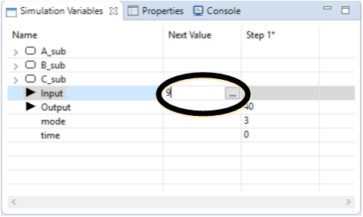{#fig:ui_next_value_column}

### Textual Constraints
Textual constraints may be entered directly into the *Next Value*. Supported expressions are described in @sec:ui_overview. 

### Input Constraint Editor
Follow the following instructions to open the *Input Constraint Editor*:

1. Select a cell in the *Next Value* column of the *Simulation Variables* view.
1. Select the **...** button.

The *Input Constraint Editor* shown in @fig:ic_editor will appear. Select the links to edit the input constraint. Constraint errors are shown below the description of the constraint.

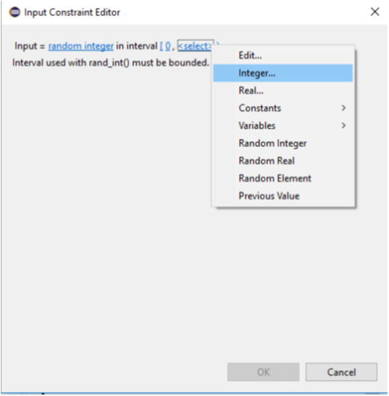{#fig:ic_editor}

## Resetting Input Constraints
Input constraints can be reset by selecting *Reset Input Constraints* from the *Simulation Variables* view's view menu () as shown in @fig:resetting_ic.

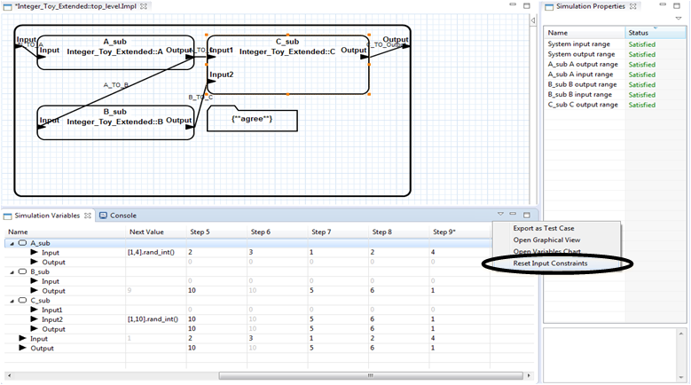{#fig:resetting_ic}

## Simulating Possibilities
Selecting the *Simulate Possibilities*  will simulate multiple possibilities for the next step after prompting for the number of steps to simulate. The simulator uses the currently specified input constraints for each possibility. At least one input constraint which will produce a random value should be specified as described in @sec:ic_format. A random value is needed to add variability to the simulation to avoid each possibility from containing the same results. Once each possibility has been simulated, the *Simulation Possibilities Chart* window shown in @fig:ui_sim_possibilities_chart will appear.  Points will be shown after configuring the X and Y axes. Selecting a point will display the values associated with the point.  Selecting *Step Forward* will advance the simulation forward using the simulation values associated with the selected data point. 

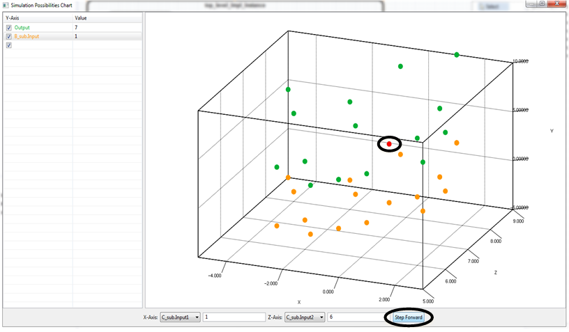{#fig:ui_sim_possibilities_chart}

## Open Variables Chart
A plot of simulation variable values can be viewed by selecting *Open Variables Chart* from the *Simulation Variables* view’s view menu (() as shown in @fig:open_variables_chart.

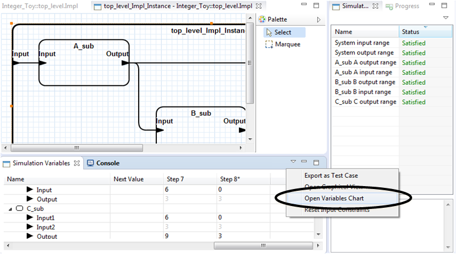{#fig:open_variables_chart}

# Navigation
The simulator supports navigating between the graphical display and the *Variables* view.

## Navigating from the Graphical Display to the Variables View
When using the graphical display, the variables associated with a shape can be shown in the *Variables* view by right-clicking on the shape and selecting *Show in Simulation Variables View* from the context menu as shown in @fig:ui_show_in_var_view.

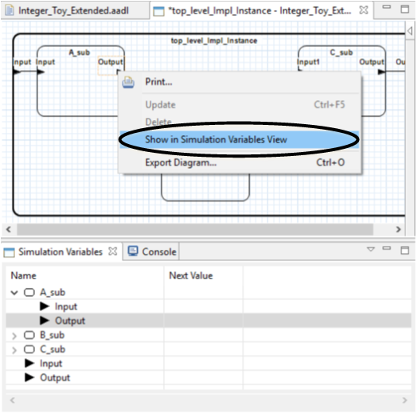{#fig:ui_show_in_var_view}

## Navigating from the Variables View to the Graphical display
When using the *Simulation Variables* view, the shape associated with a subcomponent or feature can be selected in the graphical display by right-clicking on item in the *Simulation Variables* view and selecting Show in Graphical View from the context menu as shown in @fig:ui_var_view_ctx_menu.

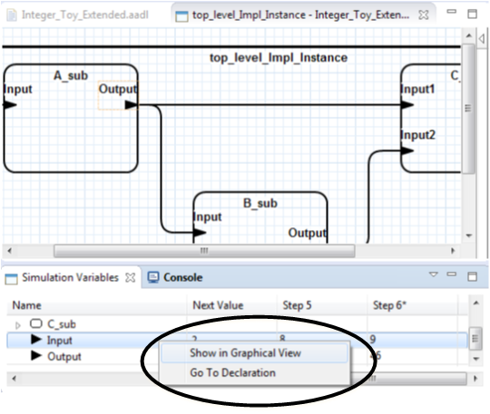{#fig:ui_var_view_ctx_menu}

## Opening the Graphical Display
The Graphical Display is automatically opened when a simulation is started. If closed, it can be reopened by selecting *Open Graphical View* from the Simulation Variables view’s view menu () as shown in @fig:ui_open_graphical_view.

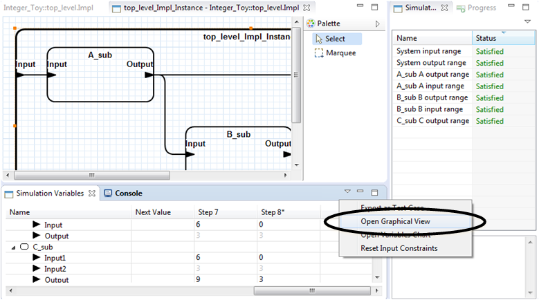{#fig:ui_open_graphical_view}

## Navigating to Property Definition
To navigate to the AGREE definition of a property, right-click on a property in the *Simulation Properties* view and select *Go To Property* from the context menu shown in @fig:ui_sim_properties_view. 

{#fig:ui_sim_properties_view}

# Input Constraint Format{#sec:ic_format}
The simulator supports using expressions to constrain a value of simulation variable. In simple cases, expressions may be literal values which force a simulation variable to a specific value. However, more complex cases such as a constraining a value to a range is supported.

------------------------------------------------------------------------------------------------------------------------------------
Description                                                                                           Example 
----------------------------------------------------------------------------------------------------  ------------------------------------------------------------------------------------------------------------------------------------------
Integer                                                                                               5 

Real                                                                                                  5.0

Boolean                                                                                               true\
                                                                                                      false\

Simulation Variable Reference                                                                         x

AGREE Constant Reference\                                                                             aadl_package_name::const_x
Only referencing AGREE constants contained in AGREE Annex Libraries is supported.               
Referencing AGREE constants declared in classifier annex subclauses is not supported.           

Reference to Previous Value                                                                           pre(x)

Arithmetic. Supported Operators: +, -, *, /                                                           1.0/3.0

Interval - Closed \                                                                                   [0, 1]\
Interval - Left-open and right-closed\                                                                (0, 1]\
Interval - Left-closed and right-open\                                                                [0, 1)\
Interval - Open\                                                                                      (0, 1)\
Interval - Left-open and right-unbounded\                                                             [0,)\
Interval - Left-unbounded and right-closed                                                            (, 1]
                                                                                                      
Set                                                                                                   {1, 2, 4}

Random Value - Selected by simulator.                                                                 [0, 1000].rand_real()\
Random values selected by the simulator may not satisfy model properties.                             [0, 1000].rand_int()\
                                                                                                      {1, 2, 4}.rand()
------------------------------------------------------------------------------------------------------------------------------------

Table: Input Constraint Syntactic Elements {#tbl:ic_elements}

## Examples
|Description | Syntax |
| ----------------------------------------------- | --------------- |
| Constrain a value relative to a value from the previous step. | pre(x) + 50.0 |
| Constrain a value to be greater than 10 and less than or equal to 50. | (10, 50] |
| Constrain a value to be greater or equal to 100. | [100, ) |
| Constrain a value to a simulator selected random value in an interval. | [0.5, 2.0].random_real() |
| Constrain a value to be within a set. | {250, 500} |
| Constrain a value to a simulator selected random member of a set. | {250, 500}.rand() |
| Constrain a value to be within ±50 of the value of x in the previous step. | [pre(x)-50.0, pre(x)+50.0] |
| Constrain a value to be a random value which is within ±50 of the value of x in the previous step. | [pre(x)-50.0, pre(x)+50.0].rand_real() |

Table: Input Constraint Examples {#tbl:ic_examples}

# Other Features
The following sections will provide details on additional capabilities provided by the simulator.

## Disabling Properties
The *Simulation Properties* view allows disabling properties. Disabling a property prevents it from affecting the simulation. To disable a property, select *Disable Property* from the context menu shown in @fig:ui_sim_properties_view. Once disabled, a property will not affect subsequent steps of the simulation. A disabled property may be enabled by selecting *Enable Property* from the same context menu.

## Simulating AGREE Counterexamples
The simulator supports simulating AGREE Counterexamples generated by an AGREE analysis. To simulate a counterexample in the simulator, right click on the guarantee in the *AGREE Results* view and select *View Counterexample in->Simulator – Monolithic* or *Simulator – Single Layer* as shown in @fig:sim_agree_cex. Once selected, the simulator will start and each step found in the counterexample will be simulated. The results of the simulation will be shown in the *Simulation Variables* view and the graphical display. 

If the entire counterexample is not simulated due to being unable to satisfy a property, an error will be displayed as shown in  @fig:sim_cex_dp. To resolve the issue, disable one or more properties from the *Simulation Properties* view and select the *Retry* button.

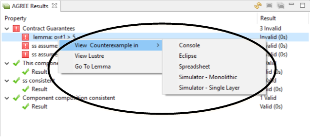{#fig:sim_agree_cex}

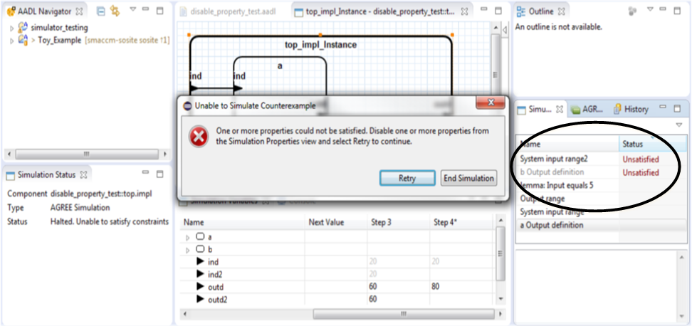{#fig:sim_cex_dp}

## Highlighting
In some cases, it may be desirable to highlight individual values within the *Simulation Variables* view. This can be done by right-clicking on a value and selecting the desired option from the context menu as shown in @fig:highlighting.

{#fig:highlighting}

## Selecting Step to View Graphically
Selecting the column header for a step in the *Simulation Variables* view will select that step to be shown in the graphical display. The selected step is indicated by an asterisk at the end of the column header.

# Status Messages
The *Simulation Status* view indicates the current status of the simulator is shown in @fig:ui_sim_status. More detailed descriptions of status message of status message are contained in @tbl:status_messages. 

{#fig:ui_sim_status}

| Message | Description |
| -------------------- | --------------------------------------- |
| Waiting for commands | The simulator is waiting for a command such as Step Forward, Step Backward, or Stop. |
| Simulating | The simulation step is in progress. |
| Halted. Unable to satisfy constraints | The simulator was unable to simulate the step due to not being able to satisfy one or more of the constraints. Check to ensure the input provided to the simulation step is valid. The simulation cannot proceed any further. |
| Warning. Property not satisfied | A property defined in the AGREE specification is not satisfied. Simulation is allowed to continue. |

Table: Status Messages {#tbl:status_messages}
